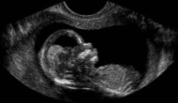

# Noise Reduction of Synthetic Aperture Radar (SAR) and Ultrasound Images | George Madeley

|University of Bath|
| :- |
|Noise Reduction of Synthetic Aperture Radar (SAR) and Ultrasound Images|
|EE40054: Digital Image Processing|

|
George Madeley

11-30-2023
|
| :- |

## **ABSTRACT**

Edge detection is a technique that identified and located boundaries of objects within an image. However, edge detection algorithms are often sensitive to noise and other artefacts which can impact the performance of the algorithm. Therefore, it is necessary to prepare the images by applying filters that reduce the noise within the image whilst also preserving edges of the objects. Filters can be classified into two main categories: linear, and non-linear. Linear filters perform linear transformations on the image, such as mean, quickly and efficiently but tend to bur the image. Non-linear filters perform non-linear transformation on the image, such as median, preserving the boundaries of the objects whilst reducing large amounts of noise at the cost of being complex and having large runtimes. This report investigates the performance of linear and non-linear filters at preparing two given images for the Sobel edge detection algorithm. The two images have varying characteristics such as level of noise, contrast, and texture. Both images are applied with each filter varying the kernel size. The filtered image corresponding to the filters and kernel sizes with the best results are passed to the Sobel edge detection algorithm. The results are evaluated and the optimum filter for each image is chosen. The investigation shows that the performance of the filter depends on the properties of the images and the objects within them.

## **CONTENTS**

[Abstract](#_toc152250211)

[Table of Figures](#_toc152250212)

[Introduction](#_toc152250213)

[Method](#_toc152250214)

- [Applying Linear Filters](#_toc152250215)

- [Applying Non-Linear Filters](#_toc152250216)

- [Apply Edge Detection](#_toc152250217)

[Testing](#_toc152250218)

- [Low-pass Filter](#_toc152250220)

- [Butterworth Filter](#_toc152250221)

- [Gaussian Filter](#_toc152250222)

- [Box Filter](#_toc152250223)

- [Geometric Mean Filter](#_toc152250224)

- [Harmonic Mean Filter](#_toc152250225)

- [Contra-Harmonic Mean Filter](#_toc152250226)

- [Median Filter](#_toc152250228)

- [Adaptive Weighted Median Filter](#_toc152250229)

- [Truncated Median Filter](#_toc152250230)

- [Min Filter](#_toc152250231)

- [Max Filter](#_toc152250232)

- [Midpoint Filter](#_toc152250233)

- [Alpha-trimmed Mean Filter](#_toc152250234)

[Edge Detection](#_toc152250235)

- [Foetus Image](#_toc152250236)

- [NZjers1 Image](#_toc152250237)

[Conclusion](#_toc152250238)

[References](#_toc152250239)

## **TABLE OF FIGURES**

[Figure 1 Original image of the foetus.](#_toc152250247)

[Figure 2 Original image of the island.](#_toc152250248)

[Figure 3 Low-pass filter applied to Foetus image with varying kernel sizes.](#_toc152250249)

[Figure 4 Low-pass filter applied to NZjers1 image with varying kernel sizes.](#_toc152250250)

[Figure 5 Foetus image applied with Butterworth low-pass filter with varying kernel sizes.](#_toc152250251)

[Figure 6 NZjers1 image applied with Butterworth low-pass filter with varying kernel sizes.](#_toc152250252)

[Figure 7 Frequency response of the Butterworth low-pass filter with varying orders.](#_toc152250253)

[Figure 8 Foetus image applied with Gaussian low-pass filter with varying kernel sizes.](#_toc152250254)

[Figure 9 NZjers1 image applied with Gaussian low-pass filter with varying kernel sizes.](#_toc152250255)

[Figure 10 Frequency response of the Gaussian low-pass filter with varying cut-off frequencies.](#_toc152250256)

[Figure 11 Foetus image applied with box filter with varying kernel sizes.](#_toc152250257)

[Figure 12 NZjers1 image applied with box filter with varying kernel sizes.](#_toc152250258)

[Figure 13 Foetus image applied with geometric mean filter with varying kernel sizes.](#_toc152250259)

[Figure 14 Intensity of the original foetus and NZjers1 image.](#_toc152250260)

[Figure 15 NZjers1 image applied with geometric mean filter with varying kernel sizes.](#_toc152250261)

[Figure 16 Foetus image applied with harmonic mean filter with varying kernel sizes.](#_toc152250262)

[Figure 17 Average intensities of Nzjers1 and foetus images filtered by the harmonic mean filter with varying kernel sizes.](#_toc152250263)

[Figure 18 NZjers1 image applied with harmonic mean filter with varying kernel sizes.](#_toc152250264)

[Figure 19 Foetus image applied with contra-harmonic mean filter with varying kernel sizes.](#_toc152250265)

[Figure 20 NZjers1 image applied with contra-harmonic mean filter with varying kernel sizes.](#_toc152250266)

[Figure 21 Foetus image applied with the median filter with varying kernel sizes.](#_toc152250267)

[Figure 22 NZjers1 image applied with the median filter with varying kernel sizes.](#_toc152250268)

[Figure 23 Foetus image applied with the adaptive weighted median filter with varying kernel sizes.](#_toc152250269)

[Figure 24 NZjers1 image applied with the adaptive weighted median filter with varying kernel sizes.](#_toc152250270)

[Figure 25 Foetus image applied with the truncated median filter with varying kernel sizes.](#_toc152250271)

[Figure 26 NZjers1 image applied with the truncated median filter with varying kernel sizes.](#_toc152250272)

[Figure 27 Foetus image applied with the min filter with varying kernel sizes.](#_toc152250273)

[Figure 28 Average intensities of the NZjers1 and foetus images filtered by the min filter with varying kernel sizes.](#_toc152250274)

[Figure 29 NZjers1 image applied with the min filter with varying kernel sizes.](#_toc152250275)

[Figure 30 Foetus image applied with the max filter with varying kernel sizes.](#_toc152250276)

[Figure 31 Average intensities of the NZjers1 and foetus image filtered with the max filter of varying kernel sizes.](#_toc152250277)

[Figure 32 NZjers1 image applied with the max filter with varying kernel sizes.](#_toc152250278)

[Figure 33 Foetus image applied with the midpoint filter with varying kernel sizes.](#_toc152250279)

[Figure 34 NZjers1 image applied with the midpoint filter with varying kernel sizes.](#_toc152250280)

[Figure 35 Foetus image applied with the alpha-trimmed mean filter with varying kernel sizes.](#_toc152250281)

[Figure 36 NZjers1 image applied with the alpha trimmed mean filter with varying kernel sizes.](#_toc152250282)

[Figure 37 Sobel edge detection results of the foetus image with varying filters.](#_toc152250283)

[Figure 38 Sobel edge detection results of the NZjers1 image with varying filters.](#_toc152250284)

## **INTRODUCTION**

Edge detection is an important technique in digital image processing as it allows enables both uses and machines to identify and locate boundaries of objects within an image. Algorithms, such as Sobel and Canny, can be used to calculate the magnitude of the edge of the objects and the direction the magnitude. However, these edge detection algorithms are sensitive to noise and other artefacts within the image which can impact the performance of the edge detection algorithms. Therefore, the images need to be prepared for edge detection by being applied with a filter to remove the noise.

Filters are mathematical algorithms that update the value of pixel in an image based on the pixels surrounding values. There are two main categories of filters: linear and non-linear. Linear filters are filters that perform a linear transform to the image, such as mean, but they tend to blur the edges of objects within the image. Non-linear filter are filters that apply a non-linear transform to the image, such as median. Non-linear filters are better at preserving the edges of objects and removing noise when compared to linear filters, but they are typically slower than linear filters.

This report will be investigating the performance of linear and non-linear filters are preparing two given images for edge detection algorithms. These two images have varying characteristics such as contrast, texture, and noise level. Each filtered is applied to the images with varying kernel sizes and the results are analysed. The filtered images that correspond to the best filters are passed through a Sobel edge detection algorithm and the results are evaluated which are used to determine the optimum filter for preparing the image for edge detection.

## **METHOD**

Before the filters can be applied to the images, a program needs to be created to perform the task. The code, programmed in Python, performs seven linear and seven non-linear filters on the input image specified by the image passed into the command line calling the program. To convolve these filter across the specified image, two classes were created, LinearFilters and NonLinearFilters, which contain the code to convolve the filters across the image.

To begin, the program loads the image specified by the command line argument when running the program. The program then passes the image into two functions which perform convolution for linear and non-linear filters respectively.

Within these functions, a results.csv file is created (if one does not already exist) and a for loop is created to loop over each type of linear and non-linear filter. Within this for loop, a nested for loop is used to loop over a range of filter sizes from three to fifteen with a step of two. Within these for loops, a function is called to create a unique filename of output image[^1]. A timer starts to calculate the runtime of the convolution and the *applyFilter* method from the respected filter class is called passing in the original image, filter name, and kernel size. This method returns the convolved image from applying the specified filter.

### **Applying Linear Filters**

The program applies one of the following filters to the image:

- Low-pass filter,
- Low-pass Butterworth filter,
- Low-pass Gaussian filter,
- Box filter,
- Geometric mean filter,
- Harmonic mean filter,
- Contra-Harmonic mean filter.

Low-pass, Butterworth, Gaussian, and box filters can all be performed within the frequency domain which drastically reduces runtime of the convolution by changing the operation from convolve in the spatial domain to product in the frequency domain. Before the convolution can be performed, methods are called to calculate and return the low-pass, Butterworth, Gaussian, and box filters. These returned filters are then passed into the *calculateFrequencyDomainConvolution* method which translates the image and the filter into the frequency domain and perform the convolution by returning the elementwise product of the two frequency domain matrices. The resulting image is translated back into the spatial domain and returned.

The geometric mean, harmonic mean, and contra-harmonic mean cannot be performed in the frequency domain and therefore required to performed in the spatial domain. To perform this convolution, a method is created which loops over the original image, exacts an image section equal in size and shape to the kernel and passes it to one of three methods. These three methods perform one the aforementioned filters to the image section. The resulting scalar value is returned and stored as its corresponding position in the output image.

### **Applying Non-Linear Filters**

The program applies one of the following non-linear filters:

- Median filter,
- Adaptive weighted median filter,
- Truncated median filter,
- Min filter,
- Max filter,
- Midpoint filter,
- Alpha-trimmed mean filter.

Apply the non-linear filters uses the same process as applying linear filters in the spatial domain. Once the region of interest has been retrieved, a method which performs one the above non-linear filter operations is performed on the region of interest returning scalar value to be stored within the output image.

Once the image has been filtered, the timer is stopped, and the image is saved. The details of the filter including the type of filter, kernel size, padding used, runtime, and filename are written to a CSV file.

### **Apply Edge Detection**

The resulting images were passed through an implementation of the Sobel edge detection algorithm where the magnitudes, direction, and a combination of the two were calculated. The resulting images were saved.

## **TESTING**

Seven linear and seven non-linear filters were tested with varying kernel sizes to grade their ability to reduce the noise in the image and make them more suitable for subsequent edge detection algorithms. These filters were tested on two images, shown in [Figure 1](#_ref152206657) and [Figure 2](#_ref152206671).

**Figure 1** Original image of the foetus.

[Figure 1](#_ref152206657) shows an ultrasound image of a foetus. The foetus image shows limited contrast on the boundaries of the foetus. There is also a large amount of high frequency text mixed with pepper noise which could be a result of motion when moving the ultrasound sensor.

**Figure 2** Original image of the island.

[Figure 2](#_ref152206671) shows an image of an island with a large amount of salt and pepper noise. In addition, there is a large contrast between the northern and southern parts of the island were, presumably, a mountain region separates the two creating the large contrast boundary.

### **Low-pass Filter**

The low pass filter only allows frequencies smaller than the cutoff frequency, D0, to pass through the image.

Hu,v=1,  &if Du,v≤D00,  &if Du,v>D0

**Equation 1** Low-pass filter.

Where:

- D(u,v) is the distance from the center of the kernel.
- D0 is the cutoff frequency of the filter.

The aim with the low-pass filter is to reduce the amount of high frequency noise in the image such as large quantities of salt and pepper noise.

[Figure 3](#_ref152206702) and [Figure 4](#_ref152206708) shows the low-pass filter applied to the images with varying kernel sizes. It can be seen that as the kernel sizes increase, the image becomes blurrier resulting in less noise but reduced improvement for edge detection algorithms.

 **Figure 3** Low-pass filter applied to Foetus image with varying kernel sizes.

**Figure 4** Low-pass filter applied to NZjers1 image with varying kernel sizes.

By observing the filtered images, the kernel size that reduces the most amount of noise whilst also maintaining consistent edges is 5 x 5.

### **Butterworth Filter**

The low-pass Butterwort filter, like the low-pass filter, reduces noise in the image by filtering out frequencies that exceed the cut-off frequency. The difference between the low-pass filter and the low-pass Butterworth filter is the Butterworth filters transfer function does not have a sharp cut-off point. Instead, a smooth transitioning between the low and high frequencies is added. The negative gradient of the transition can be in increased by increasing the order, n, of the Butterworth filter; as seen in [Figure 5](#_ref152206732).

**Figure 5** Frequency response of the Butterworth low-pass filter with varying orders.

Hu,v=11+Du,vD02n

**Equation 2** Butterworth low-pass filter.

Where:

- D(u,v) is the distance from the center of the kernel.
- D0 is the cutoff frequency of the filter.
- n is the order.

[Figure 6](#_ref152206743) and [Figure 7](#_ref152206749) shows the results of convolving the foetus image with the low-pass Butterworth filter with varying kernel sizes. The same effect from the low-pass filter seen in which as the kernel size increases, the filtered image becomes progressively blurrier.

Both [Figure 6](#_ref152206743) and [Figure 7](#_ref152206749) show that the best filtered image using the low-pass Butterworth filter are the images that were filtered with a kernel size of 5 x 5 and 7 x 7 as 5 x 5 still has some noise present but still perverse detailed edges of objects whilst 7 x 7 removes a majority of the noise but at the cost of the detailed edges.

 **Figure 6** Foetus image applied with Butterworth low-pass filter with varying kernel sizes.

 **Figure 7** NZjers1 image applied with Butterworth low-pass filter with varying kernel sizes.

### **Gaussian Filter**

The low-pass Gaussian filter, like the low-pass filter, attempts to reduce the noise in the image by removing high frequency values. Unlike the low-pass filter, the Gaussian filter implements a bell curve where the gradient of is controlled by the cut-off frequency, D0, and the central value is at 0Hz. Increasing the cut-off frequency decreases the gradient of the bell-curve and vice versa; seen in [Figure 8](#_ref152206772).

**Figure 8** Frequency response of the Gaussian low-pass filter with varying cut-off frequencies.

H(u,v)=e-D2u,v2D02

**Equation 3** Gaussian low-pass filter.

Where:

- D(u,v) is the distance from the center of the kernel.
- D0 is the cutoff frequency of the filter; usually set to the standard deviation of the region of interest.

The low pass gaussian filter was tested within varying size kernels. The cut-off frequency was calculated using the kernel size and [Equation 4](#_ref152245729).

[Figure 9](#_ref152206782) and [Figure 10](#_ref152206788) shows as the kernel size increases, so does how much the image is blurred by. It can be seen that a kernel size of 11 x 11 is preferably to use for edge detection algorithms as a majority of the noise is removed by the filter whilst also maintaining a high number of detailed edges.

σ=K-16

**Equation 4 Cut-off frequency equation for Gaussian low-pass filter.**

Where:

- K is the size of the kernel.

**Figure 9** Foetus image applied with Gaussian low-pass filter with varying kernel sizes.

**Figure 10** NZjers1 image applied with Gaussian low-pass filter with varying kernel sizes.

### **Box Filter**

The box filter, also known as the arithmetic mean filter, smooths local variations in the image by returning the average of the values within the region of interest. The noise of the image is reduced by blurring the noise into the surrounding image. However, this comes at a cost of distorting edges with large contrasts as the box filter smooths those edges.

fx,y=1mns,tϵSxyg(s,t)

**Equation 5** Box filter.

Where:

- fx,y is the value in the output image at location (x, y).
- m and n are the width and height of the kernel.
- g(s,t) is the value in the original image at location (s,t).

[Figure 11](#_ref152206800) and [Figure 12](#_ref152206806) show the foetus and Njerz1 images filtered using a box filter with varying kernel sizes. As the kernel size increase, the image become increasingly smoothed. From the results, a box filter with size 5 x 5 is preferable for edge detection as higher kernel.

sizes cause the magnitude of the edges and lower kernel sizes allows a substantial amount of salt and pepper noise to pass through the filter.

**Figure 11** Foetus image applied with box filter with varying kernel sizes.

**Figure 12** NZjers1 image applied with box filter with varying kernel sizes.

### **Geometric Mean Filter**

Geometric mean filter, a variation of the box filter, smooths the image to attenuate the contribution due to noise but aims to reduce the amount of blurring at high contrast boundaries when compared to the box filter [1].

fx,y=s,tϵSxygs,t1mn

**Equation 6** Geometric mean filter.

Where:

- fx,y is the value in the output image at location (x, y).
- m and n are the width and height of the kernel.
- g(s,t) is the value in the original image at location (s,t).

[Figure 14](#_ref152206830) and [Figure 15](#_ref152206835) shows the foetus and Njers1 images filtered using the geometric mean filter with varying kernel sizes. It can be observed that as the kernel size increases, a large amount of detail of the images is lost. This is because the geometric filter is performed by calculating the product of the values in the region of interest. As a majority of pixels within both images are zero or close to zero.

**Figure 13** Intensity of the original foetus and NZjers1 image.

[Figure 13](#_ref152206870) shows it is better the use kernels with sizes less than 9 x 9 to avoid this issue. However, kernel sizes less than 3 x 3 allow a lot of the noise to still pass through. Therefore, a kernel size of 5 x 5 was chosen. It should also be noted that kernel size increases, a large amount of detail doe edge detection is eliminated before an acceptable amount of noise is removed. Thus, making this type of filter unfit to solve this problem for these images.

**Figure 14** Foetus image applied with geometric mean filter with varying kernel sizes.

**Figure 15** NZjers1 image applied with geometric mean filter with varying kernel sizes.

### **Harmonic Mean Filter**

The harmonic mean filter, a variation of the box filter, attempts to reduce the amount of salt noise by summing the inverse of the region of interest then dividing the size of the region of interest by the sum. This results in the intensity of the salt noise being reduced at the cost of decreasing the images overall intensity. The filter fails to reduce the amount of pepper noise as it decreases the intensity of the image.

fx,y=mns,tϵSxy1gs,t

**Equation 7** Harmonic mean filter.

Where:

- fx,y is the value in the output image at location (x, y).
- m and n are the width and height of the kernel.
- g(s,t) is the value in the original image at location (s,t).

The harmonic mean filter work well for salt noise [1] as seen by the results in [Figure 17](#_ref152206935) and [Figure 18](#_ref152206902) when the kernel is 3 x 3. However, the results in [Figure 16](#_ref152206928) also that as the kernel size increases, intensity of the image decreases. This is due to how the harmonic mean is calculated. Each pixel value ranges from zero to one. To solve this, the filtered images would have to passed through to an amplifier before edge detection is performed. However, this does not amplify values that have already been reduced to zero causing some detail to be lost in the image.

**Figure 16** Average intensities of Nzjers1 and foetus images filtered by the harmonic mean filter with varying kernel sizes.

From these observations, a kernel size of 3 x 3 is preferred to prepare an image for edge detection as it removes a substantial amount of noise whilst loosing minimal amount of detail due to the reduced intensity.

**Figure 17** Foetus image applied with harmonic mean filter with varying kernel sizes.

**Figure 18** NZjers1 image applied with harmonic mean filter with varying kernel sizes.

### **Contra-Harmonic Mean Filter**

The contra-harmonic mean filter, a variation of the box filter, aims to improve the harmonic filter by reducing both salt and pepper noise whilst also preventing reduction in image intensity.  

fx,y=s,tϵSxygs,tQ+1s,tϵSxygs,tQ

**Equation 8 Contra-harmonic mean filter.**

Where:

- fx,y is the value in the output image at location (x, y).
- m and n are the width and height of the kernel.
- g(s,t) is the value in the original image at location (s,t).
- Q is called the order of the filter.

For positive order values, the filter eliminates pepper noise and for negative order values, the filter eliminates salt noise. It must be noted that the filter cannot reduce both salt and pepper noise simultaneously therefore requiring the image to be convolved by the contra-harmonic mean filter twice. However, this increases the blurriness of the image due to the side-effect of mean filters.

The images were convolved using the contra-harmonic filter with an order of ±2. It should be mentioned that operation, seen in [Equation 8](#_ref152206960), could not be fully implemented when g(s,t) and Q+1 zero or one. This is because the 00=1 and this equation could not be implemented using NumPy operations without causing the filtered image to have an infinite intensity.

[Figure 19](#_ref152206992) and [Figure 20](#_ref152206999) shows that as the kernel size increases, the filtered images become increasingly blurry. By a kernel size of 7 x 7, an acceptable amount of noise was removed by in the process, high contrast boundaries began to smooth out. Therefore, a kernel size of 5 x 5 was chosen as the optimum kernel size for edge detection.

**Figure 19** Foetus image applied with contra-harmonic mean filter with varying kernel sizes.

**Figure 20** NZjers1 image applied with contra-harmonic mean filter with varying kernel sizes.

### **Median Filter**

The median filter is a type of order-statistic filter. Order-statistic filters are filters that can only be performed in the spatial domain as their response is based on ordering/ranking the pixels contained in the region of interest.

The median filter convolves the image by returning the median value of the region of interest.

fx,y=medians,tϵSxy{g(s,t)}

**Equation 9** Median filter.

Where:

- fx,y is the value in the output image at location (x, y).
- g(s,t) is the value in the original image at location (s,t).

The median filter reduces random noise, such as salt and pepper, effectively with a reduced amount of blurring when compared to linear filters such as the box filter.

[Figure 21](#_ref152207016) and [Figure 22](#_ref152207023) shows that as the kernel size increases, so does the blurriness of the filtered images. However, due to how effective median filters are, a substantial amount of noise is lost by before an unacceptable amount of blurring occurs; by kernel size 7 x 7. Therefore, the optimum kernel size to perform the median filter for the foetus image is 7 x 7 and 5 x 5 for the NZjers1 image.  

**Figure 21** Foetus image applied with the median filter with varying kernel sizes.

**Figure 22** NZjers1 image applied with the median filter with varying kernel sizes.

### **Adaptive Weighted Median Filter**

Weighted median filter is a filter which changes how many times each value within the region of interest is repeated. The weighted median filter improves on the median filter by restoring specialization which generates moving edges by improving the chance that a given pixel is center around the median [2].

fx,y=medians,tϵSxyw1\*g1,…,wn×m\*gn×m

**Equation 10** Weighted median filter.

Where:

- fx,y is the value in the output image at location (x, y).
- m and n are the width and height of the kernel.
- gi is value within the region of interest.
- wi\*fi={fi,fi,fi} if wi=3.

The adaptive weighted median filter uses the same algorithm as the weighted median filter but generates the weights based on a given constant, central value, mean, standard deviation, and distance each pixel is away from the center of the region of interest. These weights priorities the central value in the region of interest over the surrounding values. Changing the central value and constant changes how much the filter priorities the central value. Constants less than zero cause the filter to prioritize values further away from the center of the region of interest rather than values closer to the center.

f(x,y)=medians,tϵSxyws-x,t-y∘gs,t

wi,j=WK+1,K+1-cdσx

**Equation 11** Adaptive weighted median filter.

Where:

- WK+1,K+1 is the central weight.
- c is a constant.
- d is the distance from centre of the kernel.

Tests were conducted filtering the foetus and NZjers1 image with varying kernel sizes whilst keeping the central value at 100 and constant to 10. [Figure 23](#_ref152207053) and [Figure 24](#_ref152207061) shows that as the kernel size increases, so does how much the filtered image is blurred. By kernel size 7 x 7, a large proportion of the noise is removed from the image. The optimum kernel size for the foetus image is 7 x 7 as the edges are still preserved to a high quality. The optimum kernel size for the NZjers1 image is 5 x 5 as a kernel size of 7 x 7 blurs the boundaries by too large of a degree therefore, the size before it must be chosen.

**Figure 23** Foetus image applied with the adaptive weighted median filter with varying kernel sizes.

**Figure 24** NZjers1 image applied with the adaptive weighted median filter with varying kernel sizes.

### **Truncated Median Filter**

Another order-statistic filter is the mode filter however, there is an issue with the mode filter. When all the values within the region of interest are unique, the mode cannot be calculated. The truncated median filter attempts to solve this issue.

On a symmetrical bell curve, the mean, median, and mode are all the same value. However, when the bell curve is shifted, these values no longer align. This can be resolved by cropping/truncating the bell curve until the median aligns with the mode. How much the bell curve is truncated is dependent on the difference between the minimum and median and the difference between the median and maximum values.

dmin=mins,tϵSxygs,t-medians,tϵSxygs,t

dmax=medians,tϵSxygs,t-maxs,tϵSxygs,t

d=dmin-dmax

**Equation 12** Truncated median filter.

Where:

- fx,y is the value in the output image at location (x, y).
- g(s,t) is the value in the original image at location (s,t).
- d is the cutoff value to truncate the region of interest by.

If d is positive, only the values smaller than d are removed from the region of interest. If d is negative, values bigger than mn-d are removed from the region of interest. By performing this operation, the truncated median filter successfully emulates calculating the mode of the region of interest and in doing so becomes an effective filter for removing speckle noise [3]

[Figure 25](#_ref152207079) and [Figure 26](#_ref152207084) shows that as the kernel size increases, the image becomes progressively blurrier but maintains the most common image intensity within each region. This proves affective when identifying the boundaries between extreme light and dark intensities but not for less noticeable edges.

The optimum kernel size for the foetus image is 9 x 9 as a large amount of the features of the foetus are preserved after filtering. For the NZjers1 image, the optimum kernel size is 5 x 5 as the shape of the island is still preferred despite small intensities of noise being present.

**Figure 25** Foetus image applied with the truncated median filter with varying kernel sizes.

**Figure 26** NZjers1 image applied with the truncated median filter with varying kernel sizes.

### **Min Filter**

The min filter, another order-statistics filter, which returns the minimum value from the region of interest. By finding the minimum value, the filter proves highly effective at removing salt noise from an image but in turn cause the pepper noise to grow in size. In addition, by only using the minimum value of the region of interest, the overall intensity of the image decreases.

fx,y=mins,tϵSxy{g(s,t)}

**Equation 13** Min filter.

Where:

- fx,y is the value in the output image at location (x, y).
- g(s,t) is the value in the original image at location (s,t).

[Figure 28](#_ref152207129) and [Figure 29](#_ref152207136) shows that when the min filter is applied, a majority of the salt noise is removed but as the kernel size increase, the size of the pepper noise increases creating a pixelated effect across the filtered image. In addition, as the kernel size increase, the overall intensity of the image decreases; proven by [Figure 27](#_ref152207151). This could be remedied by passing the filtered image through an amplifier however, that could increase the contrast between boundaries and thus increase the magnitude in edge detection.

**Figure 27** Average intensities of the NZjers1 and foetus images filtered by the min filter with varying kernel sizes.

The filter would be affective for images which contain a majority of salt noise but as both the foetus image contains a majority of pepper noise and NZjers1 image contain equal proportions of salt and peppers, the filter is not effective to prepare the images for edge detection.

**Figure 28** Foetus image applied with the min filter with varying kernel sizes.

**Figure 29** NZjers1 image applied with the min filter with varying kernel sizes.

### **Max Filter**

The max filter performs the opposite operation of the min filter in that the max filter returns the maximum value of the region of interest. Because the filter returns the maximum value, the filter is highly effective for reducing pepper noise within the image but at the cost of increasing the size of the salt noise.

fx,y=maxs,tϵSxygs,t

**Equation 14** Max filter.

Where:

- fx,y is the value in the output image at location (x, y).
- g(s,t) is the value in the original image at location (s,t).

[Figure 31](#_ref152207171) and [Figure 32](#_ref152207180) shows that when the max filter is applied a majority of the pepper noise is removed from the image but as the kernel size increases, the size of the salt noise increasing resulted in a pixelated image. In addition, as the kernel size increases, so does the intensity of the image, proven by [Figure 30](#_ref152207166). This can be remedied by attenuating the image, but this reduces the contract at boundaries in the image therefore reducing the change the boundary is picked up in edge detection.

**Figure 30** Average intensities of the NZjers1 and foetus image filtered with the max filter of varying kernel sizes.

The results in [Figure 31](#_ref152207171) and [Figure 32](#_ref152207180) show that the max filter is not appropriate the prepare the image for edge detection regardless of the kernel size as it distorts the edges of the objects within the images.

**Figure 31** Foetus image applied with the max filter with varying kernel sizes.

**Figure 32** NZjers1 image applied with the max filter with varying kernel sizes.

### **Midpoint Filter**

The midpoint filter aims to solve the issues of the min and max filter by combining the filters to reduce both salt and pepper noise. This is done by summing the minimum and maximum values within the region of interest and dividing by two to find the midpoint of the values in the region of interest. As the filter combines min, max, and mean, it is more optimised for randomly distributed noise such as Gaussian. Due to find the midpoint of the region of interest, boundaries of high contrast become blurred.

fx,y=12mins,tϵSxygs,t+maxs,tϵSxygs,t

**Equation 15** Midpoint filter.

Where:

- fx,y is the value in the output image at location (x, y).
- g(s,t) is the value in the original image at location (s,t).

By increasing the coefficient, the filter prioritises removing pepper noise over salt and by decreasing the coefficient, the filter prioritises salt noise over pepper.

[Figure 34](#_ref152245762) shows that as the kernel size increases, the edges of the object begin to distort resulting in a hazing effect until the kernel size of 9 x 9 at which point the filtered images become pixelated.

Despite the hazing and pixelated affects, the filter does remove an acceptable amount of salt and pepper noise at low kernel sizes. At large kernel sizes, the size of the salt noise begins the grow and become noticeable.

From the results show in [Figure 33](#_ref152245769) and [Figure 34](#_ref152245762), the optimum kernel size to prepare the images for edges detection is 3 x 3.

**Figure 33** Foetus image applied with the midpoint filter with varying kernel sizes.

**Figure 34** NZjers1 image applied with the midpoint filter with varying kernel sizes.

### **Alpha-trimmed Mean Filter**

The alpha-trimmed mean filter, a variation of the box filter, truncated the number of values in the region of interest. The number of values removed is determined by d.

fx,y=1mn-ds,tϵSxygrs,t

**Equation** 16 Alpha-trimmed mean filter.

Where:

- d is the number of elements removed ranging from 0 to mn-1.
- gr(s,t) represents the remaining mn-d pixels.

When d is equal to zero, the alpha-trimmed mean filter becomes the box filter. When d=mn-12, the alpha-trimmed mean filter simulates a median filter. By changing the value of d changes how much the filter acts the mean and median filter [4].

[Figure 35](#_ref152245790) and [Figure 36](#_ref152245796) shows that as the kernel size increases, the image becomes progressively blurrier. This is because the number of pixels we remove, d, stays constant regardless of kernel size. As the kernel size increases, the percentage of pixels removed gets closer. With an infinite sized kernel, the percentage of pixels removed would be 0% resulting in the alpha-trimmed mean filter reducing to the box filter [1]. The box filter, as discussed, blurs the image at high kernel values.

From the results, seen in [Figure 35](#_ref152245790) and [Figure 36](#_ref152245796), a kernel size of 7 x 7 removes an acceptable amount of noise from the image however, this comes with the cost that the image becomes unacceptably blurry. Smaller kernel sizes reduce the amount of blur but contain larger amounts of noise. Regardless, a kernel size of 7 x 7 is the best for the alpha-trimmed mean filter.

**Figure 35** Foetus image applied with the alpha-trimmed mean filter with varying kernel sizes.

**Figure 36** NZjers1 image applied with the alpha trimmed mean filter with varying kernel sizes.

## **Edge Detection**

Each of the filters, and their chosen kernel size, which proved they are suitable to prepare the images for edge were run through the edge detection code. [Figure 37](#_ref152245820) and [Figure 38](#_ref152245824) shows the results.

### **Foetus Image**

**Figure 37** Sobel edge detection results of the foetus image with varying filters.

Geometric mean, harmonic mean, contra-harmonic mean, median, adaptive weighted median, and truncated median did not result is well defined edge detection when passed through the edge detection algorithm. The remaining filters displayed well defined edge despite some remaining noise however, [Figure 37](#_ref152245820) shows that the filter that resulted in the best edge detection result is the Gaussian filter with a kernel size of 9 x 9.

### **NZjers1 Image**

**Figure 38** Sobel edge detection results of the NZjers1 image with varying filters.

[Figure 38](#_ref152245824) shows that the midpoint filter with a kernel size of 3 x 3 still contained a large amount of noise when passed through the edge detection algorithm and therefore proved that the filter did not suitably prepare the image for edge detection.

The median, adaptive weighted median, and truncated median filters all displayed well defined edges especially the truncated median. However, the edge detection algorithm was unable to detect the edge of the darker, bottom part of the image. The Contra-harmonic mean filter was successfully able to prepare the image for edge detection as the boundaries of the object are detectable by the edge detection algorithm. Therefore, the contra-harmonic mean filter with a kernel size of 5 x 5 was chosen as the filter that prepared the image for edge the detection the best.

## **CONCLUSION**

This report investigated the performance of seven linear and seven non-linear filters at preparing two images, the foetus and NZjers1, for edge detection algorithms. We applied each filter varying the size of the kernel and region of interest and compared the results and the effects the parameters of the filters had on the image. Once the best kernel size for each filter was selected, the filtered images corresponding to those kernel sizes was passed through a Sobel edge detection algorithm and the quality of the resulting images was evaluated.

The results showed that what filter and kernel size is the optimum to use to prepare the image for edge detection depended on the characteristics of the image such  noise level, contrast, and texture. For the foetus image, which contained a large amount of pepper noise and high frequency textures, the Gaussian filter with an 11 x 11 kernel size performed the best at reducing noise whilst preserving the edges of the image. For the NZjers1 image, which contained boundaries of high contrast and an even distribution of salt and pepper noise, the contra-harmonic filter with a 5 x 5 kernel size performed the best at reducing the noise whilst preserving the edges of the object. However, it should be mentioned that the truncated filter, with a kernel size of 5 x 5, had the based performed for isolating the edges whilst reducing noise however, this filter was not selected as it did not successfully preserve all the edges of the object.

Based on the results, a conclusion can be made that there is no single best filter for preparing images for edge detection algorithms, and the optimal filter depends on the properties of the images.

## **REFERENCES**

|[1] |R. C. Gonzales and R. E. Woods, Digital Image Processing, 2nd ed., A. Dworkin, Ed., Upper Saddle River, New Jersey: Tom Robbins, 2001. |
| :- | :- |
|[2] |L. Duval, “What is the advantage of weighted median filter over median filter?,” Stack Exchamge, 15 September 2015. [Online]. Available: https://dsp.stackexchange.com/questions/22412/what-is-the-advantage-of-weighted-median-filter-over-median-filter. [Accessed 29 November 2023].|
|[3] |A. N. Evans and M. S. Nixon, “Mode filtering to reduce ultrasound speckle for feature extraction,” *IEE Proceedings - Vision Image and Signal Processing,* vol. 142, no. 2, pp. 87-94, 1995. |
|[4] |S. Rasathurai, “What is aplha-trimmed mean filter?,” Stack overflow, 18 September 2020. [Online]. Available: https://stackoverflow.com/questions/63948384/what-is-aplha-trimmed-mean-filter. [Accessed 30 Novemeber 2023].|
|[5] |S. Marschner and P. Shirley, Fudamentals of Computer Graphics, 4th ed., Palm Beach, Florida: CRC Press, 2015. |
